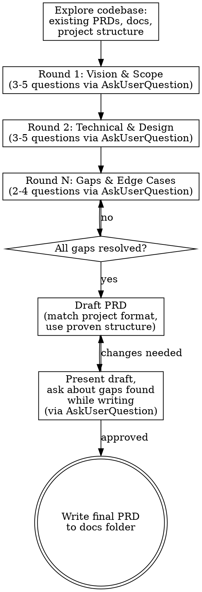

# PRD Create

## Overview

Create a comprehensive PRD through iterative questioning. Never assume -- ask the user for every design decision. Produce a document that matches the project's existing PRD conventions.

**Your ONLY deliverable is a written PRD document in the `docs/` folder. Do NOT edit source files, generate content files, write code, or produce an implementation plan. The PRD describes WHAT to build and WHY -- implementation happens separately after the user approves the PRD.**

## Tool Usage

**You MUST use the `AskUserQuestion` tool for ALL questions to the user.** This includes question rounds, draft review feedback, and clarification requests. Do not ask questions as plain text output -- always route them through `AskUserQuestion` so the user gets a structured prompt they can respond to.

## Process



## Before First Question

1. Read `CLAUDE.md`, `README.md`, or similar project convention docs
2. Search for existing PRDs/design docs in `docs/`, `design/`, `specifications/`, or similar
3. If PRDs exist, read 2-3 to learn the project's format, section structure, and level of detail
4. Scan project structure to understand the architecture
5. If the feature touches existing systems, read relevant source files

## Question Rounds

All questions in every round must be asked via `AskUserQuestion`. Batch 3-5 questions per round (the tool supports up to 4 questions per call -- use multiple calls if needed).

### Round 1 -- Vision & Scope
Ask about the big picture. Explain WHY each question matters so the user can give better answers.

- What problem does this solve?
- Who is the audience/user?
- What is in scope vs explicitly out of scope?
- What existing systems does this touch?
- Are there prerequisites or dependencies?

### Round 2 -- Technical & Design
Based on Round 1 answers, ask about implementation specifics.

- Data structures, state, and storage
- User-facing behavior and interactions (ask for concrete examples)
- Error states and failure modes
- Configuration and extensibility
- Performance constraints or targets

### Round 3+ -- Gaps & Edge Cases
Identify what is still ambiguous after earlier rounds.

- Unaddressed edge cases found during exploration
- Conflicts with existing systems discovered in code
- Migration or backward compatibility concerns
- Testing and validation approach
- Boundary conditions and limits

**Keep asking until every section can be written without guessing.** It is always better to ask one more round than to fill in a gap with an assumption.

## Proven PRD Structure

The following structure has proven effective across many successfully implemented PRDs. Use it as your default when the project has no existing PRD convention. Adapt, reorder, or omit sections based on what the feature needs -- not every PRD requires every section.

### Recommended Sections

**1. Status Line** (top of document, blockquote)
```
> **Status: NOT STARTED** -- Brief description of current state
```
Use NOT STARTED, IN PROGRESS, DONE, or REFACTOR as appropriate.

**2. Executive Summary**
1-3 paragraphs covering what this PRD proposes and why. Optionally include a "Why?" or "Motivation" subsection for complex changes. If major design decisions were made during the question rounds, list them as bullets here so readers get the high-level picture immediately.

**3. Problem Statement / Current State**
- What exists today and what are its limitations
- Use a table to compare current behavior vs proposed behavior when the contrast is informative
- Reference specific existing code, files, or systems by name

**4. Goals and Non-Goals**
- Goals: concrete, measurable outcomes
- Non-Goals: explicitly state what is deferred, referencing "future PRD" or "future work" to set clear scope boundaries

**5. Target Syntax / User Experience**
- Concrete examples showing the proposed interface (API, CLI, UI, config format, language syntax, etc.)
- Progress from simple to complex examples
- Use real-world use cases, not abstract descriptions
- Show the user's perspective first, technical details second

**6. Architecture / Technical Design**
- ASCII-art diagrams for system interactions when they add clarity
- Data structures with code blocks
- Algorithm descriptions or pseudocode for non-obvious logic
- Constraint tables (limits and their rationale)

**7. Impact Assessment**
A table or list showing what stays the same vs what changes. Prevents implementers from accidentally modifying stable components or missing required changes.

| Component | Status | Notes |
|-----------|--------|-------|
| X | **Stays** | No changes needed |
| Y | **Modified** | Reason for change |
| Z | **New** | Created by this work |

**8. File-Level Changes**
Tables mapping specific files to the changes needed. Include both files to modify and files to create. If applicable, note files that explicitly require NO changes.

| File | Change |
|------|--------|
| path/to/existing.ext | Description of modification |
| path/to/new.ext | New file -- purpose |

**9. Implementation Phases** (when the work is complex enough to warrant staging)
Numbered phases with:
- Clear goal per phase (one sentence)
- Files to modify/create in that phase
- Dependencies on prior phases noted
- A testing/verification step per phase
- "Future" phases clearly separated from core work

**10. Edge Cases**
Explicitly enumerate edge cases. For each, show:
- The input or situation
- The expected behavior
- Rationale if the behavior is non-obvious

Format as subsections or a structured list, not a vague paragraph.

**11. Testing / Verification Strategy**
- Per-phase or per-feature test plan
- Concrete test examples (specific inputs and expected outputs)
- Build/run commands if relevant
- Manual testing scenarios for things that are hard to unit test

### Formatting Conventions

- Use numbered section hierarchy (1., 1.1, 1.2) for easy cross-referencing
- Use horizontal rules (`---`) between major sections
- Use markdown tables for structured comparisons, parameter specs, and phase summaries
- Intersperse code examples throughout relevant sections (not just in one "examples" section)
- Mark anything still uncertain as **[OPEN QUESTION]** rather than guessing

## Drafting

- Match the format of existing PRDs in the project exactly (section structure, heading style, table usage, code block conventions)
- If no existing PRDs, use the Proven PRD Structure above
- Prefer concrete over abstract: file paths, function signatures, data schemas, tables with specific values, real examples
- Every choice in the PRD must trace to a user answer
- When a feature is complex, recommend phased implementation with clear deliverables per phase
- Always include an edge cases section -- enumerate at least the obvious boundary conditions
- Always include a testing/verification section -- even a brief one is better than none
- Include an impact assessment when the change touches existing systems

## Anti-Patterns

| Temptation | Do this instead |
|---|---|
| Filling gaps with reasonable defaults | Ask about the gap (via `AskUserQuestion`) |
| Asking all questions in one huge list | 3-5 per round, digest answers first |
| Asking questions as plain text | Always use `AskUserQuestion` tool |
| Assuming technology choices | Ask what tools/patterns to use |
| Skipping codebase exploration | Always explore first |
| Writing after one round of questions | Minimum 2-3 rounds |
| Making design decisions for the user | Present options, let user choose |
| Jumping to implementation after (or instead of) writing the PRD | Write the PRD document to `docs/` and STOP. No code, no content files, no implementation plan |
| Writing abstract descriptions without examples | Include concrete code/config/CLI examples for every feature |
| Skipping edge cases | Enumerate at least the obvious boundary conditions |
| Describing tests vaguely ("write unit tests") | Specify concrete test inputs and expected outputs |
| Omitting impact on existing systems | Include a "what stays vs what changes" assessment |

## Pushing Back

Only push back on choices that are **obviously problematic** -- contradictions, impossible constraints, or conflicts with existing systems. When pushing back:

1. State the specific concern with evidence (code reference, logical conflict)
2. Ask (via `AskUserQuestion`) if the user has considered the issue
3. Accept the user's final decision

## Output

Write the final PRD to the project's `docs/` directory matching existing naming conventions. Report the file path to the user.

**Then stop.** Do not proceed to implementation planning, code changes, file generation, or any other modifications. The PRD document is the complete deliverable. If the user wants to implement, they will ask separately.
