# PRD Implementation Audit

## Overview

Audit a PRD's implementation after the fact. Verify every goal against real code, catch stubs / TODOs / unfinished paths, run whatever validation commands the project exposes (tests, playbooks, build, lint, typecheck), cross-check the git diff against the PRD's file-level changes, and produce both interactive findings (via `AskUserQuestion`) and a written audit report.

**Running the validation commands is table stakes — the implementor already did that.** The audit's real job is to answer a harder question: **do the tests that pass actually cover what the PRD promised?** Every goal, every edge case, every new public function, and every new failure path should have a test that would catch a regression. Gaps found during the audit are not closed until a test is written for them (or the user explicitly accepts them as un-tested).

**This skill is language- and framework-agnostic.** It infers validation commands from project files (`CLAUDE.md`, `README`, `package.json`, `Makefile`, `pyproject.toml`, `go.mod`, `Cargo.toml`, CI configs, etc.) rather than assuming any stack. Always confirm discovered commands with the user before running them.

**Your deliverables:**
1. A written audit report in the project's audit folder (default `docs/audits/`).
2. (Conditional, on user confirmation) A PRD **Status** line update if the audit passes.
3. **New or extended tests** covering any fixes made during the audit and any Coverage Gaps the user agreed to close. The audit leaves the test suite strictly better than it found it.

Do not silently edit source files to fix findings. Report → confirm → fix → add regression test.

## Tool Usage

**All critical findings MUST be presented via `AskUserQuestion`.** Critical severities are Unmet Goal, Stub, Regression, Coverage Gap, and Missing Test. Present them one severity group at a time, each as a separate `AskUserQuestion` call, in descending severity order. Wait for a response before moving to the next group. Lower-severity findings (Scope Drift, Convention Drift, Suggestion) may be consolidated into fewer calls. The written report captures everything regardless.

## Process

```dot
digraph prd_audit {
  rankdir=TB;
  node [shape=box];

  identify  [label="Identify target PRD\n(user-provided or ask)"];
  read      [label="Read PRD:\nextract Goals, Non-Goals,\nFile-Level Changes,\nTesting Strategy"];
  base      [label="Determine audit base\n(commit that introduced\nthe PRD, or ask)"];
  scope     [label="Cross-check scope:\nPRD file-list vs git diff\n(extras + misses)"];
  discover  [label="Discover validation\ncommands from project files"];
  confirm   [label="Confirm commands\nvia AskUserQuestion"];
  run       [label="Run confirmed commands,\ncapture pass/fail"];
  static    [label="Static audit:\nstubs, goal tracing,\nconvention drift"];
  coverage  [label="Test coverage investigation:\ntrace each goal, edge case,\nand new public function to\nthe test that exercises it"];
  categorize[label="Categorize findings by severity"];
  p_unmet   [label="Present Unmet Goals\n(AskUserQuestion)"];
  p_stub    [label="Present Stubs\n(AskUserQuestion)"];
  p_regr    [label="Present Regressions\n(AskUserQuestion)"];
  p_gap     [label="Present Coverage Gaps\n(AskUserQuestion)"];
  p_test    [label="Present Missing Tests\n(AskUserQuestion)"];
  p_lower   [label="Present Scope/Convention Drift\nand Suggestions"];
  resolved  [label="All criticals resolved?" shape=diamond];
  finalize  [label="Finalize: write regression tests\nfor fixes + closing tests for\naccepted Coverage Gaps\n(AskUserQuestion per write)"];
  rerun     [label="Re-run confirmed commands"];
  green     [label="Suite green?" shape=diamond];
  report    [label="Write audit report\n(default docs/audits/)"];
  status    [label="PRD Status update?\n(AskUserQuestion)" shape=diamond];
  done      [label="Done" shape=doublecircle];

  identify -> read -> base -> scope -> discover -> confirm -> run -> static -> coverage -> categorize;
  categorize -> p_unmet -> p_stub -> p_regr -> p_gap -> p_test -> p_lower -> resolved;
  resolved -> p_unmet [label="new findings"];
  resolved -> finalize [label="yes"];
  finalize -> rerun -> green;
  green -> finalize [label="no -- new finding"];
  green -> report [label="yes"];
  report -> status -> done;
}
```



## Before First Finding

1. **Identify the PRD.** If the user didn't supply a path, ask via `AskUserQuestion` (offer a small menu of `docs/*` PRDs if discoverable).
2. **Read the PRD fully.** Extract:
   - Status line (current value)
   - Goals (as a checklist for the report)
   - Non-Goals (to decide whether out-of-scope changes are drift or unrelated work)
   - File-Level Changes table (files to modify, files to create)
   - Implementation Phases (if present)
   - Edge Cases
   - Testing / Verification Strategy
3. **Determine the audit base commit.**
   - Default: `git log --diff-filter=A --format=%H -- <prd-path> | tail -1` (commit that introduced the PRD file).
   - If the PRD file has been renamed or moved, check `git log --follow`.
   - If nothing is found, ask the user for a base ref (branch or commit).
   - Tip of audit is `HEAD` unless the user specifies otherwise.
4. **Cross-check scope.**
   - `git diff <base>..HEAD --name-only` → actual files changed.
   - Compare to PRD's file-level changes table.
   - Record **extras** (changed but not in PRD) and **misses** (in PRD but not changed).
5. **Discover validation commands.** Scan, in this order:
   - `CLAUDE.md` / `AGENTS.md` / top-level `README.md` — look for command/run sections, playbooks, build instructions.
   - `package.json` → `scripts` (test, lint, typecheck, build, e2e).
   - `Makefile` / `justfile` / `taskfile.yml` — common targets.
   - `pyproject.toml`, `tox.ini`, `pytest.ini`, `setup.cfg` → `pytest`, `ruff`, `mypy`.
   - `go.mod` → `go test ./...`, `go vet ./...`, `golangci-lint run`.
   - `Cargo.toml` → `cargo test`, `cargo clippy`, `cargo check`.
   - `composer.json`, `Gemfile`, `mix.exs`, `deno.json`, `pubspec.yaml` — per-ecosystem conventions.
   - `.github/workflows/*.yml`, `.gitlab-ci.yml`, `.circleci/config.yml` — CI commands are strong hints for what the project actually runs.
   - Project-specific scripted-test folders (e.g., `playbooks/`, `fixtures/`, `e2e/`).
6. **Confirm commands via `AskUserQuestion`.** Present discovered commands as a multi-select list so the user can deselect any that shouldn't run (expensive integration tests, flaky suites, long builds). Offer a notes field for custom additions.
7. **Run confirmed commands.** Capture pass/fail and a short output tail per command. Any failure is a **Regression** candidate — but verify it wasn't already failing on `<base>` before labeling it.
8. **Static audit + coverage investigation.** Walk §Validation Checklist end-to-end. Section 4 ("Test & Coverage Investigation") is the heavy lifting — do not skim it just because the suite was green on step 7.

## Validation Checklist

### 1. Goal Fulfillment

For every goal in the PRD, locate the code that delivers it. Apply the inverse of the Implementability Test:

> For each goal, can I point to a specific file and function (with `file.ext:line`) that implements it? If no, it's an **Unmet Goal**.

Half-implemented goals (partial code paths, one of several requirements missed) are also Unmet. Capture evidence in the report as `file.ext:line`.

### 2. File-Level Changes Coverage

- Every file the PRD promised to modify or create — does the diff touch it?
- Files changed outside the PRD's list — flag as **Scope Drift** and ask the user if they're intentional (refactors, incidental fixes, unrelated work sharing the branch).
- Files promised in the PRD but untouched in the diff — often indicates an Unmet Goal; investigate before labeling.

### 3. Stubs & Unfinished Paths

Grep the changed files (and any new files) for language-agnostic stub markers:

- Comment markers: `TODO`, `FIXME`, `XXX`, `HACK`
- Explicit not-implemented throws: `NotImplementedError`, `unimplemented!()`, `panic!("todo")`, `throw new Error("not implemented")`, `assert False, "todo"`
- Godot-specific (when applicable): `push_warning("stub")`, `push_warning("not implemented")`, `push_error("TODO")`
- Empty function bodies: `pass`, `return`, `{}`, `return null` where a real implementation was promised
- Placeholder returns: literal `0`, `null`, `false`, empty collections returned from functions that the PRD says should compute a value
- Large commented-out blocks (roughly 10+ lines) — potential reverted or abandoned work
- Magic stub values: `"FIXME"`, `"TBD"`, `"xxx"` in strings

For each hit, capture `file.ext:line` and a 1-line snippet.

### 4. Test & Coverage Investigation

This is the core of the audit. "The suite is green" is a starting point, not a conclusion — investigate whether the passing tests actually exercise what the PRD promised.

- **Goal-to-test traceability.** For every PRD goal, name the specific test (test file + test name, or playbook path) that would fail if the goal regressed. If you cannot name one → **Coverage Gap**.
- **Edge-case traceability.** For every entry in the PRD's Edge Cases section, name the specific test that actually triggers that case. A test that merely *mentions* the edge case in a comment or name but never drives it still leaves a gap.
- **New / changed public function reachability.** List public functions (or exported symbols, depending on language) added or materially changed by the diff. For each, grep the test tree for a caller. Uncalled public functions → Coverage Gap.
- **Branch and error-path coverage (heuristic).** Scan new code for conditionals (`if/else`, `match`, `switch`, `try/except`, early-return invariant guards) and explicit failure paths (`push_error`, thrown exceptions, `return null` on failure, error enums). For each, check whether any test exercises the non-happy-path branch. Sampling is fine when the new code is large — cite which branches you sampled so the user can extend the check if they want.
- **Integration / end-to-end coverage.** Cross-system PRDs (logistics touching save/load, UI wiring into gameplay, DB migrations touching request handlers) need an integration test or scripted playbook that exercises the full flow. Unit coverage of each piece in isolation is not enough. If the PRD's scope crosses system boundaries and no end-to-end test exists → Coverage Gap.
- **Pass/fail of existing tests.** Still required — but downgraded from the headline. Failing tests belong to §5 Regressions.
- **Presence of PRD-named tests.** If the PRD's Testing Strategy names a specific test artifact (e.g., "add playbook `foo.playbook`") and it doesn't exist → **Missing Test**.

**Coverage Gap vs Missing Test (don't confuse these):**
- *Missing Test*: the PRD explicitly named a test artifact that isn't present.
- *Coverage Gap*: a claim, code path, or edge case has no test exercising it, regardless of whether the PRD named one. Every Missing Test is also a gap; not every gap is a Missing Test.

### 5. Regressions

- Any confirmed validation command that fails on `HEAD`?
- Before labeling as a regression, check whether the same command also fails on `<base>`. If it does, it's a pre-existing failure — note it in the report but don't count it as a regression introduced by this PRD.
- Running the suite at `<base>` is opt-in (may be slow). Ask before checking out base to re-run.
- Also scan the diff for unrelated churn that could mask regressions: accidentally committed debug prints, reverted imports, dependency version bumps unrelated to the PRD's scope.

### 6. Convention Drift

- Read the project's `CLAUDE.md` / `AGENTS.md` / style guide. Cross-reference against the diff.
- Flag **explicit** rule violations, not style nits. Examples of rules worth flagging: "no unbounded loops in per-frame code," "no raw `print()`," "no UI nodes created in code," "no hardcoded paths," "PRs must update migration version."
- Do not invent rules. If the project doesn't document a rule, don't flag it.

### 7. PRD Status Consistency

- Read the PRD's Status line.
- Compare to reality: if Status says `NOT STARTED` but the diff clearly ships the feature, flag for update. If Status says `COMPLETE` but Unmet Goals remain, flag for update in the other direction.

## Severity Definitions

| Severity | Definition | Criterion | Critical? |
|---|---|---|---|
| **Unmet Goal** | A PRD goal has no implementation (or a half-implementation) | Cannot point to code delivering the goal in full | Yes |
| **Stub** | Unfinished code path shipped as if complete | TODO/FIXME, NotImplemented marker, placeholder return, empty body where work was promised | Yes |
| **Regression** | Something that worked on base now fails on HEAD | Validation command passes on `<base>` and fails on `HEAD` | Yes |
| **Coverage Gap** | A PRD claim, new public function, or edge case has no test exercising it | Cannot name a specific test that would fail if the behavior regressed | Yes |
| **Missing Test** | PRD-promised test artifact is absent | PRD's Testing Strategy names a specific test file; that file doesn't exist | Yes |
| **Scope Drift** | Changes inside or outside the PRD's stated file-level scope | Files modified not in PRD, or files in PRD not touched | No |
| **Convention Drift** | Code violates a documented project convention | Explicit rule in `CLAUDE.md` / convention doc is broken | No |
| **Suggestion** | Non-blocking improvement | Polish, optional coverage, cleanup opportunity | No |

## Presenting Findings

Use `AskUserQuestion`, one severity group per call, in this order: **Unmet Goal → Stub → Regression → Coverage Gap → Missing Test → Scope Drift → Convention Drift → Suggestion**. Skip empty groups. Frame each finding as a question, not a directive. Always include `file.ext:line` so the user can jump straight to the code.

### Example: Unmet Goals (first AskUserQuestion call)

> PRD Goal "Players can cancel an in-flight transport" has no corresponding code. Nearest match is `src/logistics/transport_worker.gd:120` which only handles completion, not cancellation. Was this deferred intentionally, or should it be implemented before marking the PRD complete?

> PRD Goal "Save/load preserves construction progress" — `to_save_dict` in `src/buildings/construction_site.gd:88` omits the `progress` field. Should we add it, or is this considered acceptable loss?

### Example: Stubs (second AskUserQuestion call)

> `src/logistics/builder_worker.gd:142` — `# TODO: handle path recompute when target moves`. The PRD's Edge Cases section calls out moving targets. Fix now, or accept as known limitation?

> `src/roads/road_manager.gd:220` — function `clear_segment_cache()` body is `pass`. Was this stubbed for a follow-up PR?

### Example: Regressions (third AskUserQuestion call)

> `godot45 scenes/levels/main.tscn -- --playbook playbooks/test_woodcutter.playbook` passes on `<base>` (abc1234) but fails on HEAD with "assertion failed: assert_stock LOG 20". The failure is at the new `consume_inhabitant` call. Investigate or roll back the call?

### Example: Coverage Gaps (fourth AskUserQuestion call)

> PRD's Edge Cases section lists "enemy path blocked by newly-placed building." `src/military/enemy_pathfinding.gd:210` implements the recompute, but no test or playbook places a building on an in-flight enemy path. Add a playbook that triggers this, or accept as un-tested?

> `GatherWorker.harvest_failed()` at `src/logistics/gatherer_worker.gd:88` is a new error path — nothing in the test tree calls it, and the green suite only exercises the happy path. Write a unit test that drives the failure, or accept?

> PRD Goal "Save/load preserves construction progress" is implemented at `src/buildings/construction_site.gd:88`, but no existing playbook saves mid-construction and loads. The closest test (`playbooks/test_construction.playbook`) finishes the build before saving. Add a save-mid-build playbook, or accept?

### Example: Missing Tests (fifth AskUserQuestion call)

> PRD's Testing Strategy phase 2 says "add playbook `test_road_bulldoze.playbook`" — no such file in `playbooks/`. Add it now, or defer to follow-up?

### Example: Scope / Convention / Suggestions (consolidated calls)

> Scope Drift: the diff touches `src/ui/resource_hud.gd` but the PRD's file-list doesn't include it. Is this an incidental fix, and if so, should it be called out in the report?

> Convention Drift: `src/magic/card_deck.gd:54` uses `print()` directly; CLAUDE.md requires `Log.log(Log.Module.MANA, ...)`. Fix in-place, or log as follow-up?

> Suggestion: The `EnemySpawner.spawn_enemy()` path in `src/military/enemy_spawner.gd:88` has no unit test. Worth adding one while the change is fresh?

## Finalize the Audit

Before writing the report, close every loop the audit opened. An audit that discovers a problem, triggers a fix, and then moves on has left the same trap in place for next time.

1. **For every fix the user approved during the audit** (code change made to resolve an Unmet Goal, Stub, Regression, or Convention Drift): write or extend a test that would have caught the original problem. Confirm the test plan via `AskUserQuestion` before writing — describe the scenario, the file it will live in, and what it asserts. A fix without a regression test is a silent invitation for the bug to come back.

2. **For every Coverage Gap the user accepted for closure**: write the test that closes it. Confirm per-test via `AskUserQuestion` (group related tests into one call when they share a file and setup). Follow the project's existing test patterns — read neighboring tests or playbooks for structure before writing.

3. **Re-run the confirmed validation commands.** The suite must be green after the new tests land. If a newly-written test fails, that is a real finding, not a footnote — loop back and present it as an Unmet Goal or Regression. Do not proceed to the report until the suite is green, or the user explicitly accepts a documented failure.

4. **Record every new test file and every extended test block** for the report's "Tests Added / Extended" section.

If the user declines to close a Coverage Gap, keep it in the report under Coverage Gaps with a clear "accepted as un-tested — reason: …" note. The audit trail must reflect the decision, so a later reader knows the gap was considered, not missed.

## Report Output

After the Finalize phase is complete and the suite is green, write a markdown audit report to the project.

- **Location:** ask the user on first run via `AskUserQuestion`. Default option: `docs/audits/`. Create the folder if missing. Alternative offered options: next to the PRD (`<prd-name>_audit.md`), or a user-provided custom path.
- **File name:** `{prd-filename-stem}_audit_{YYYY-MM-DD}.md` (today's date).
- **Structure:**

  ```markdown
  # Audit: <PRD Title>

  **PRD:** `<prd-path>`
  **Audit base:** `<base-commit> (<date>)`
  **Audit head:** `<head-commit> (<date>)`
  **Audited:** <today>

  ## Goal Verification

  | Goal | Status | Evidence |
  |---|---|---|
  | <goal 1> | Met | `file.ext:line`, `file.ext:line` |
  | <goal 2> | Partial | `file.ext:line` -- missing X |
  | <goal 3> | Unmet | -- |

  ## Validation Commands

  | Command | Result | Notes |
  |---|---|---|
  | `pnpm test` | Pass (432 tests) | |
  | `pnpm lint` | Fail | 3 errors in `src/foo.ts` -- see findings |

  ## Findings

  ### Unmet Goals
  - ...

  ### Stubs
  - `file.ext:line` -- <snippet> -- **resolved:** <decision>

  ### Regressions
  - ...

  ### Coverage Gaps
  - `file.ext:line` -- <claim/path> -- **resolved:** test added at `test/path` / accepted as un-tested (reason)

  ### Missing Tests
  - ...

  ### Scope Drift
  - ...

  ### Convention Drift
  - ...

  ### Suggestions
  - ...

  ## Decisions Recorded

  <capture what the user accepted as intentional vs what was fixed during the audit>

  ## Tests Added / Extended

  | File | Kind | Covers |
  |---|---|---|
  | `playbooks/test_enemy_path_recompute.playbook` | new | Edge case: enemy path blocked by newly-placed building |
  | `src/logistics/gatherer_worker.gd` (extended test block) | extended | Error path: harvest failure |

  ## Post-Finalize Validation

  | Command | Result |
  |---|---|
  | `pnpm test` | Pass (435 tests, +3 from audit) |
  | `godot45 scenes/levels/main.tscn -- --playbook playbooks/test_enemy_path_recompute.playbook` | Pass |

  ## PRD Status

  - Before: `NOT STARTED`
  - After: `COMPLETE` (or unchanged, with reason)

  ## Recommended Next Steps

  <only if unresolved criticals remain>
  ```

## PRD Status Update

After all findings are resolved and the Finalize phase has left the suite green:

- If **every goal is Met**, **zero critical findings remain unresolved** (no Unmet Goal / Stub / Regression / Coverage Gap / Missing Test), **and every fix made during the audit has a regression test that now passes**: ask via `AskUserQuestion` whether to flip the PRD's `**Status:**` line to `COMPLETE`. On yes, edit the PRD file.
- If the result is partial (some goals Met, some deferred-by-user-decision): offer `IN PROGRESS` as an option, or keep the current value.
- If criticals remain unresolved: **do not** touch the Status line. Note the recommended future status in the report's "Recommended Next Steps" section.

The PRD file is the only file this skill may edit that is not its own audit report. All such edits require explicit `AskUserQuestion` confirmation.

## Rules

- **Always use `AskUserQuestion`** for critical findings (Unmet Goal, Stub, Regression, Coverage Gap, Missing Test). Lower severities may be consolidated but still cannot be silently fixed.
- **Never silently edit source code.** If the user approves a fix during the audit, make the edit and note it in the report's "Decisions Recorded" section. Unapproved fixes are not made.
- **Be language- and framework-agnostic.** Never assume a stack. Infer validation commands from project files and confirm them.
- **Confirm every command before running.** Never run destructive commands (`rm`, `git reset --hard`, `git push --force`, deploy scripts, package publish, database migrations) even if discovered in project files. If such a command appears in the discovery list, exclude it silently and note that fact.
- **Cite file:line for every claim.** "I think it's implemented" is not evidence. If you can't cite, it's an Unmet Goal.
- **Distinguish regressions from pre-existing failures.** Verify failing commands also fail on `<base>` before calling them regressions.
- **Tests passing is not coverage.** A green suite that doesn't exercise a promised path is a Coverage Gap, not a pass. Trace each PRD goal and edge case to a specific test that would fail if the behavior regressed.
- **Don't close the audit until new tests are in.** Every fix approved during the audit needs a regression test; every accepted Coverage Gap needs a closing test. Re-run the suite green before writing the report.
- **Write the report even when findings are light.** The report is the audit trail; always produce it.
- **Don't touch the PRD Status line without explicit confirmation**, even when the audit is a clean pass.

## Anti-Patterns

| Temptation | Do this instead |
|---|---|
| Declaring a goal met without citing code | Cite `file.ext:line` as evidence or mark Unmet |
| Running every discovered command indiscriminately | Confirm via `AskUserQuestion`; exclude destructive commands |
| Silently fixing TODOs / stubs you find | Present them as findings; let the user decide |
| Skipping the report because findings were small | Always write the report -- it's the audit trail |
| Flipping PRD Status without asking | Always confirm via `AskUserQuestion` first |
| Assuming a stack (e.g., "it's Python, run pytest") | Inspect project files; confirm discovered commands |
| Treating scope drift as automatically bad | Ask the user -- refactors and incidental fixes happen |
| Dumping all findings in one call | One severity group per `AskUserQuestion`, criticals first |
| Inventing convention rules | Only flag violations of rules the project documents |
| Labeling every failing test as a regression | Check base -- pre-existing failures aren't introduced here |
| Editing source files to "clean up" unrelated code | Stay inside the audit; unrelated cleanup is out of scope |
| Marking a goal Met because "the tests pass" | Name the specific test that would fail if the goal regressed; if you can't, it's a Coverage Gap |
| Fixing a bug during the audit and moving on | Also write a regression test -- the same bug will come back otherwise |
| Writing the report before re-running the suite | Re-run the validation commands after test additions; a failing add-on is a new finding, not a footnote |

## Output

Three deliverables:
1. The audit report file at the confirmed location.
2. New or extended test files covering fixes made during the audit and Coverage Gaps the user accepted for closure.
3. (Conditional) The PRD's `**Status:**` line updated, on user confirmation.

End-of-run summary to the user: criticals resolved count, tests added count, report file path, PRD status change (or "unchanged -- reason"). Nothing else.
