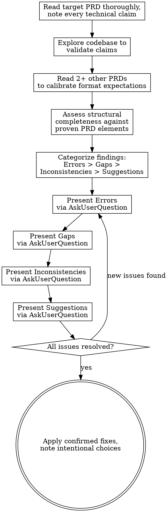

# PRD Review

## Overview

Review an existing PRD by validating its claims against the actual codebase, assessing structural completeness, and presenting findings as questions to the user. Never silently fix -- ask first, apply after confirmation.

## Tool Usage

**You MUST use the `AskUserQuestion` tool for ALL findings and questions.** Do not present findings as plain text output. Present findings **one severity group at a time**, each as a separate `AskUserQuestion` call, in order: Errors first, then Gaps, then Inconsistencies, then Suggestions. Wait for the user to respond to each group before presenting the next. This ensures the most critical issues are addressed first.

## Process

## Validation Checklist

Check each of these systematically against the codebase:

### 1. Factual Accuracy
- File paths mentioned -- do they exist? Are names correct?
- Class names, function signatures, enum values -- do they match the code?
- Descriptions of existing behavior -- does the code actually work that way?
- Referenced systems or APIs -- do they exist with the described interface?

### 2. Structural Completeness

Check whether the PRD includes the structural elements that have proven essential for successful implementation. Not every PRD needs every element, but their absence should be a conscious choice rather than an oversight.

**Status and scope:**
- Does the PRD have a status indicator (e.g., status line at top)?
- Are goals concrete and measurable (not vague aspirations)?
- Are non-goals explicitly stated, setting clear boundaries?
- Are prerequisites or dependencies identified?

**Concreteness:**
- Does the PRD include concrete examples (code, config, CLI, UI mockups)?
- Do examples progress from simple to complex, covering real use cases?
- Are data structures, APIs, or interfaces specified with enough detail to implement without guessing?
- Could an implementer build this feature using only the PRD, without asking clarifying questions?

**Edge cases and error handling:**
- Are edge cases explicitly enumerated (not just "handle edge cases")?
- For each edge case, is the expected behavior specified?
- Are error states and failure modes addressed?
- Are boundary conditions identified (empty inputs, max limits, concurrent access, etc.)?

**Impact and change tracking:**
- Does the PRD identify what existing components are affected?
- Is there an assessment of what stays the same vs what changes?
- Are file-level changes mapped (files to modify, files to create)?

**Implementation clarity:**
- If the work is complex, is it broken into phases with clear deliverables per phase?
- Are phase dependencies noted?
- Is there a testing or verification strategy (concrete test cases, not "write tests")?

### 3. Consistency
- Terms match the project's vocabulary (check CLAUDE.md, other PRDs)?
- Data formats match existing conventions?
- Naming conventions followed (file names, class names, identifiers)?
- Proposed patterns match existing architecture?

### 4. Implementability
- Can each section be implemented without ambiguity?
- Are there implicit decisions that need to be made explicit?
- Are there circular dependencies or ordering issues?
- Is the scope realistic given the described prerequisites?
- Are there sections where the implementer would have to guess intent?

### Implementability Test

For each major feature or section, apply this mental test:

> If I handed this PRD to a competent developer unfamiliar with the project, could they implement this section without asking me a single clarifying question?

If the answer is no, identify specifically what is missing and report it as a **Gap**.

## Presenting Findings

Present findings via `AskUserQuestion`, one severity group per call, in descending severity order. Frame each finding as a question, not a directive. Skip empty severity groups.

### Severity Definitions

| Severity | Definition | Criterion |
|----------|-----------|-----------|
| **Error** | Factually wrong claim | A file path, function name, or behavioral description that contradicts the actual codebase |
| **Gap** | Missing information that blocks implementation | An implementer would have to guess or ask a question to proceed |
| **Inconsistency** | Internal contradiction or conflict with codebase patterns | Two parts of the PRD disagree, or the proposal conflicts with existing conventions |
| **Suggestion** | Non-blocking improvement | Structural additions, clarity improvements, or alignment with proven PRD patterns |

### Example: Errors (first AskUserQuestion call)

Use `AskUserQuestion` with questions like:

> [Section X] PRD references `src/foo/bar.ext` but this file is at `src/baz/bar.ext`. Should I update the path?

> [Section Y] says the function takes 3 parameters, but the actual signature in `module.ext:42` takes 5. Should the PRD match the current code, or is this describing a planned API change?

### Example: Gaps (second AskUserQuestion call)

> [Section Z] describes the happy path but doesn't cover what happens when the input is empty. What should happen?

> The PRD specifies 5 API endpoints but includes no edge case section. At minimum, these boundary conditions need decisions: [list specific cases]. Should I add an edge cases section?

> The implementation section lists files to modify but no testing strategy. Should I add concrete test cases per phase?

### Example: Inconsistencies (third AskUserQuestion call)

> [Section A] says FooManager handles dispatch, but `foo_manager.ext` delegates to BarDispatch. Which is the intended design?

> [Section B] uses the term "handler" but the codebase consistently uses "controller". Should the PRD align with the codebase terminology?

### Example: Suggestions (fourth AskUserQuestion call)

> Other PRDs in this project include a "What Stays vs What Changes" table. Adding one here would clarify impact on existing systems. Would you like me to draft one?

> The executive summary lists design decisions but doesn't include a "Why?" subsection explaining the motivation. Other successful PRDs include this. Worth adding?

## Rules

- **Always use `AskUserQuestion`** to present findings. Never present findings as plain text.
- **Never silently fix.** Present findings, wait for confirmation, then apply.
- **Only push back on obviously wrong claims** (e.g., referencing a file that doesn't exist). For design choices, ask if they are intentional.
- **Trace every file path, class name, and identifier** mentioned in the PRD against the codebase.
- **Review scope is accuracy and completeness, not redesign.** Do not propose alternative architectures unless the user asks. Structural suggestions should be framed as "other successful PRDs include X -- would this be useful here?" not "you should restructure this."

## Anti-Patterns

| Temptation | Do this instead |
|---|---|
| Presenting findings as plain text | Always use `AskUserQuestion` tool |
| Dumping all findings at once | Present one severity group at a time, most critical first |
| Rewriting sections without asking | Ask first, fix after confirmation |
| Reporting only surface issues | Validate claims against code AND assess structural depth |
| Treating all issues as equal severity | Categorize: Errors > Gaps > Inconsistencies > Suggestions |
| Suggesting design changes | Note and ask, do not prescribe |
| Skipping codebase exploration | Always grep/read before reporting |
| Accepting vague descriptions | Flag sections where an implementer would have to guess |
| Ignoring missing edge cases | Check for explicit edge case coverage and flag if absent |
| Overlooking missing test strategy | Check for concrete verification plan and flag if absent |

## Output

After all rounds complete, apply confirmed fixes to the PRD file. Summarize what was changed and what was kept as-is with the user's reasoning noted.
